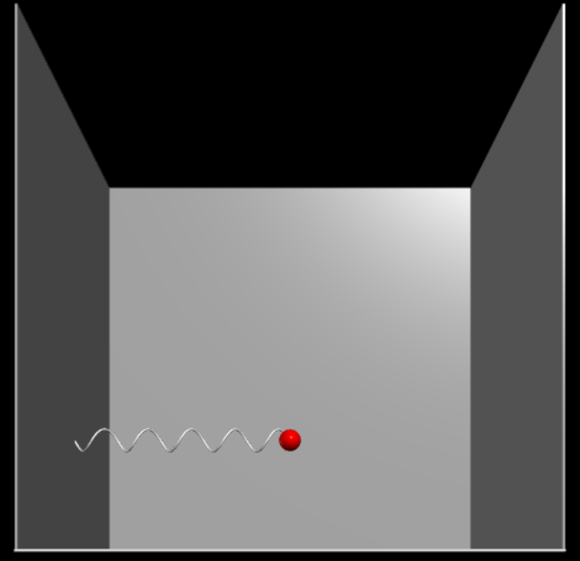

# Initial Understanding
This project is meant to provide a simple test bed for development and learning of an RMC controller. 
Specifically, the project is aimed for modeling hydraulic actuators interfacing with ropes and masses.

The project provides a physics simulation for general purpose, 'similar-to-life', physics scenarios so that equations of motion
do not need to be derived for a given scenario. The project also incorporates the interfaces required for interacting with real-world devices.
It utilizes the Measurement Computing Company (MCC) [USB-202](https://files.digilent.com/manuals/USB-202.pdf) for analog and digital input and the MCC [USB-3114](https://files.digilent.com/manuals/USB-3114.pdf) for analog outputs.

To provide a visualization for the user, there is a 3D visualization engine built using [VPython](https://vpython.org/). In addition, there is a wrapper for PyQtGraph so that
real-time data can be plotted for physics, sensors, HITL controller, or any combination.

# Initial Setup
## Required Software Installation
1. Install `Python 3.11.4 through Company Portal`. This ensure the global configuration is set correctly for installing packages.
2. Install the Measurement Computing Universal Library for Windows with [code/setup/mccdaq.exe](code/setup/mccdaq.exe). DAQami does NOT need to be installed. Only `InstaCal & Universal Library`.
3. Run the Python dependecy installer by executing `python code/setup/dependencies.py`. This includes VPython, PyQtGraph, numpy, typing, and mcculw. vpython and PyQtGraph are significantly larger than the others. They are used for 3D visualization and plotting respectively. numpy is used for faster 'C-like' vectors. typing is for type hints in the code. mcculw is for interfacing with the MCC devices.

[code/setup/icalsetup.exe](code/setup/icalsetup.exe) is used for InstaCal installation. This is not required as Python performs the device configuration for MCC3114 and MCC202. InstaCal will create a configuration file in `C:/ProgramData/Measurement Computing/DAQ` called `CB.CFG`.  This file is created when you configure the MCC devices. Note, 1 configuration file is made for the entire system of devices. It is not per device. The Python code in [code/MCC_Inferface](code/MCC_Interface.py) configures the devices as necessary upon initialization. Therefore, a manual configuration through InstaCal is not needed.


# Setting Up a HITL Simulation
It is strongly recommended to go through this guide with an example up. Before writing the code to setup a HITL simulation, have a clear idea of what joints you will need along with the springs and actuators. Each object will need specific information about how to set it up such as a joint's position, springs characteristics, and an actuator's control behavior.

## Physics Elements
Controller elements are located in [code/Physics_Elements.py](code/Physics_Elements.py). There are 3 main physics elements. [joints](#joint), [springs](#spring), and [rigid actuators](#rigidactuator). [StateSpace](#statespace) is also included as a physics element.

### StateSpace
StateSpace is where the Newtonian physics takes place. Each [Joint](#joint) is assigned a StateSpace at initialization. As the simulation runs, the StateSpace will be integrated over its acceleration and velocity to function as the physics engine.

The user will never need to create a StateSpace manually. It is always handled through the creation of a [Joint](#joint). Understanding the basic aspects of the StateSpace can help understand behavior of the physics simulation. A simple integration method is shown. This is an abstraction of what StateSpace does.
```
class StateSpace():
    def __init__(self, pos=np.copy(ZERO_VECTOR), vel=np.copy(ZERO_VECTOR), accel=np.copy(ZERO_VECTOR), force=np.copy(ZERO_VECTOR), integration_method="simple"):
        self.pos = pos
        self.vel = vel
        self.accel = accel
        self.force = force
    
    def integrate(self, delta_t: float):
        self.vel = self.vel + self.accel * delta_t
        self.pos = self.pos + self.vel * delta_t
```
By default a StateSpace is initialized with all zeroes. It is typical to assign a position at [Joint](#joint) creation which is passed to the StateSpace. integration_method is passed from the creation of a [Joint](#joint) to specify the type of integration to use. This allows for a mix of speed and accuracy.

### Joint
A Joint is a single point in space with mass. It has its own StateSpace. Joints can either be fixed in space or free (they can also be driven by an actuator which is a special case handled during creation of an actuator).

Here is the code to create a Joint
```
joint = Joint(
    pos: array_like,        # The initial position of the joint. typically use np.array([x, y, z])
    mass: float,            # The mass in kg of the joint. Disregarded if fixed == True
    fixed: bool,            # If true, the Joint will never move.
    name: str,
    integration_method: str # "simple" (default), "verlet", "adams-bashforth"
)
```
Now that the joint is created, it can be connected to a spring, actuator, or nothing if it is fixed.

#### Joint Extra Attributes
The Joint class has a few extra functions that are useful for certain use.

```
joint.add_gravity()         # Add gravity at 9.81 m/s^2

joint.add_damping(          # Add either velocity or momentum damping. If mom_ratio is specified, disregard vel_ratio
    vel_ratio: float,       # Add a force equal to the negative velocity in m/s scaled by vel_ratio
    mom_ratio: float        # Add a force equal to the negative momentum in kg*m/s scaled by mom_ratio
)

joint.add_constant_force(   # Add a constant force to be applied to the joint
    new_force: array_like   # Typically use np.array([x, y, z])
)

joint.add_variable_force(   # Add a time varying force in the form of a function pointer (NOT lambda function) to be applied to the joint
    force_vect: array_like  # Typically use np.array([f1, f2, f3]) where f = func1(t:float)
)
```

### Spring
A Spring connects 2 Joints and applies a force on them. Springs use the StateSpace of the parent [Joint](#joint) and child [Joint](#joint) attached to them. They calculate their $\vec r = \vec x_{child} - \vec x_{parent}$ and $\Delta l$ to get their force vector. Tension is treated as positive in all cases.

Here is the code to create a Spring
```
spring = Spring(
    parent_joint: Spring,
    child_joint: Spring,
    unstretched_length: float,                                          # Zero force length
    contant_stiffness: float,                                           # Constant k value. Ignored if stiffness_func != None
    stiffness_func: func(length: float, unstretched_length) -> float,   # Function pointer for variable stiffness
    name: str
)
```
Now that the Spring is created, it will be simulated in the physics simulation. The physics simulation knows it exists because each [Joint](#joint) keeps track of the springs attached to it.

The Spring class has no other attributes for the user to work with.


### RigidActuator
A RigidActuator connects 2 Joints, a "grounded" joint and a "parent" joint. The grounded [Joint](#joint) is fixed and will not move. The parent joint is controlled in relation to the grounded joint. All RigidActuators must be controlled by something. They will either control the length of the actuator or the velocity. The RigidActuator will only move in the direction of the $\vec r = \vec x_{grounded} - \vec x_{parent}$.

Here is the code to create a RigidActuator
```
rigid_actuator = RigidActuator(
    parent_joint: Joint,
    grounded_joint: Joint,
    name: str,
    max_length: float,
    min_length: float,
    control_code: int           # 0 for displacement control, 1 for velocity control, 2 for acceleration control
)
```
Now that the RigidActuator is created, it will be simulated in the physics simulation. The physics simulation knows it exists because each [Joint](#joint) keeps track of the actuators attached to it.

The RigidActuator class has no other attributes for the user to work with.


## Sensor Elements
Sensor  elements are located in [code/Sensor_Elements.py](code/Sensor_Elements.py). Sensor elements are how you take something from the physics simulation and bring it to the real-world with voltage outputs.

Because the physics simulation and HITL controller processes are separate, you must create a shared object to link them. These shared objects are SharedJoint and SharedSpring. They will need to be attached to both the raw physics element ([Joint](#joint), [Spring](#spring)) and the sensor element (LoadCellJoint, LoadCellSpring, DisplacementSensor).

### LoadCell
Parent class to [LoadCellJoint](#loadcelljoint) and [LoadCellSpring](#loadcellspring)

### LoadCellJoint
A load cell can be attached to a [Joint](#joint) with LoadCellJoint. This is less developed than LoadCellSpring as the force on a point in space is less representative than a force between joints. This is due to how it represents the force. It takes the net force applied by springs in any direction on the joint and vector sums them.


Create and attach a LoadCellJoint with 
```
load_cell_joint = LoadCellJoint(sensor_settings: dict = {
    "name": str,
    "mV/V": float,
    "excitation": float,
    "full_scale_force": float,      # What is the max force on the load cell
    "output_channel": int           # The output channel that the load cell outputs through the MCC3114. Must be between [0, 15]
})
load_cell_joint.attach_sim_source(shared_joint)

hitl_controller.attach_load_cell(load_cell_joint)
```
To allow the LoadCellJoint to get data from the physics engine, attach an instance of `SharedJoint` named 'shared_joint' through `load_cell_joint.attach_sim_source(shared_joint)`.

Now, the attach the LoadCellJoint to the HITL controller through `hitl_controller.attach_load_cell(load_cell_joint)`. Now, the controller will actually know there is a sensor that needs to be output.


### LoadCellSpring
A load cell can also be attached to a [Spring](#spring) with LoadCellSpring. This is much more representative of a load cell in the real world as it only outputs a force along a vector (defined as the spring vector $\vec r$).

Create and attach a LoadCellSpring with
```
load_cell_Spring = LoadCellSpring(sensor_settings: dict = {
    "name": str,
    "mV/V": float,
    "excitation": float,
    "full_scale_force": float,      # What is the max force on the load cell
    "output_channel": int           # The output channel that the load cell outputs through the MCC3114. Must be between [0, 15]
})
load_cell_spring.attach_sim_source(shared_spring)

hitl_controller.attach_load_cell(load_cell_spring)
```
To allow the LoadCellSpring to get data from the physics engine, attach an instance of `SharedSpring` named 'shared_spring' through `load_cell_spring.attach_sim_source(shared_spring)`.

Now, the attach the LoadCellSpring to the HITL controller through `hitl_controller.attach_load_cell(load_cell_spring)`. Now, the controller will actually know there is a sensor that needs to be output.

### DisplacementSensor
A position/displacement sensor can be attached to any two joints with DisplacementSensor. This allows for a scalar length between the joints to be output through the MCC3114.

Create and attach a DisplacementSensor with
```
displacement_sensor = DisplacementSensor(
    parent_joint: SharedJoint,       # Must be a SharedJoint for the sensor to get values from the sim
    child_joint: SharedJoint,        # Must be a SharedJoint for the sensor to get values from the sim
    sensor_settings: dict = {
        "name": str,
        "neutral_length": float,     # This is the 0 voltage value. Can be 0 for purely positive voltage output or non-zero to allow negative voltage output
        "volts_per_meter": float,    # How many volts per meter of length should the MCC3114 output 
        "output_channel": int        # The output channel that the load cell outputs through the MCC3114. Must be between [0, 15]
    }
)
hitl_controller.attach_displacement_sensor(displacement_sensor)
```
The DisplacementSensor gets data from the SharedJoints that are specified as a parent_joint and child_joint. The axis vector of the displacement sensor is given by $\vec r = \vec x_{child} - \vec x_{parent}$. For a scalar sensor, this plays no importance. Length is the vector length of $\vec r$.

Now, the attach the DisplacementSensor to the HITL controller through `hitl_controller.attach_displacement_sensor(displacement_sensor)`. Now, the controller will actually know there is a sensor that needs to be output.


## Controller Elements
Controller elements are located in [code/Controller_Input_Elements.py](code/Controller_Input_Elements.py). Controller elements are how a real-world controller can control something inside of the physics simulation.

Because the physics simulation and HITL controller processes are separate, you must create a shared object to link them. The only shared objects for a controller element is `SharedRigidActuator` which links the controller to the physics simulation so it can control the actuator.

In reference to the data sharing paths in the process diagram, the hitl controller pushes the commanded attribute (velocity or position) to the SharedRigidActuator and the physics sim pulls the commanded attribute.

With the MCC202, the range is [-10, +10] V. Any exceeding past this range can cause damage to the device. Digital inputs operate on [0, 5] V TTL and should not experience voltage below 0 V or above 5.5 V to avoid damage.

### RigidActuatorController
A [RigidActuator](#rigidactuator) in the physics simulation is useless without a RigidActuatorController to move it. As a reminder, a [RigidActuator](#rigidactuator) connects 2 joints: the grounded and the parent joint. The grounded joint will never move. The parent joint can be controlled along the axis of the actuator. The user can specify whether the controller commands the position or the velocity of the parent joint with respect to the grounded joint.

Create and attach a RigidActuatorController with
```
rigid_actuator_controller = RigidActuatorController(controller_settings: dict = {
    "name": str,
    "analog_input_channel": int,     # The analog channel on the MCC202 that controls the rigid actuator. Must be between [0, 7]
    "digital_input_channel": int,    # The digital channel on the MCC202 that enables control of the rigid actuator. Must be between [0, 7]
    "units_per_volt": float,         # m/V or m/s/V. How far or how fast the actuator should move per volt
    "neutral_length": float,         # Length to go to when given neutral voltage (position control). Also used for starting
    "neutral_voltage": float,        # The voltage at which to go to neutral_length (position control) or zero velocity (velocity control)
    "controls_pos/vel/accel": int,   # 0 = controls pos, 1 = controls vel, 2 = controls accel
    "max_length": float,
    "min_lenght": float
})
rigid_actuator_controller.attach_sim_target(shared_rigid_actuator)

hitl_controller.attach_rigid_actuator_controller(rigid_actuator_controller)
```
To allow the RigidActuatorController to command the physics engine to respond to real-life inputs, attach an instance of `SharedRigidActuator` named 'shared_rigid_actuator' with `rigid_actuator_controller.attach_sim_target(shared_rigid_actuator)`. 

Now, the attach the RigidActuatorController to the HITL controller through `hitl_controller.attach_rigid_actuator_controller(rigid_actuator_controller)`. Now, the controller will actually know there is a rigid actuator that it needs to get inputs for and command.


## Sharing Elements
Sharing elements refers to the data flow of object between processes using pipes. This is largely hidden from the user as multiprocessing.managers.BaseManager does this for us. It creates AutoProxy elements of each element we "share" and when we "attach" them to an instance of a class, they are given access to the AutoProxy object. The processes that have access to the AutoProxy objects can interact with them in 1 fashion: function calls. Direct access to internal attributes is not possible without a copy of the object. So, there are numerous getters and setters for each "shared" object for data retrieval and setting.

For the most part, sharing elements is for allowing sensor and controller elements to communicate with the elements in the physics simulation. A [LoadCell](#loadcell) needs a [SharedJoint](#sharedjoint) or a [SharedSpring](#sharedspring), a [DisplacementSensor](#displacementsensor) needs 2 [SharedJoints](#sharedjoint), a [RigidActuatorController](#rigidactuatorcontroller) needs a [SharedRigidActuator](#sharedrigidactuator). A sensor element will be connected by attaching a shared element to the sensor through "attach_sim_source". A controller element will be connected by attaching a shared element to the controller through "attach_sim_target".

Any element can also be plotted and some can be 3D visualized. Those elements will also need a shared element. This is usually taken care of by attaching the shared element to the base element through "attach_shared_attributes".

### BaseManager
The BaseManager is how elements can be shared amongst processes.

Here is the code to make an instance of the BaseManager and register classes to be shared
```
from multiprocessing.managers import BaseManager
base_manager = BaseManager()

BaseManager.register('SharedFloat', SharedFloat)

BaseManager.register('SharedJoint', SharedJoint)
BaseManager.register('SharedSpring', SharedSpring)
BaseManager.register('SharedRigidActuator', SharedRigidActuator)

BaseManager.register('SharedLoadCellJoint', SharedLoadCellJoint)
BaseManager.register('SharedLoadCellSpring', SharedLoadCellSpring)
BaseManager.register('SharedDisplacementSensor', SharedDisplacementSensor)

BaseManager.register('SharedRigidActuatorController', SharedRigidActuatorController)

base_manager.start()
```
After the instance is created, each class that needs to be shared needs to be registered. When registering classes, the objects must be 'picklable'. I have never run into an instance where I could not share an object except for when the object contained a lambda function.

Each of the shared elements is setup to have strong similarity with each other and the thing they are representing. They are also supposed to do as little calculation as possible. In a best scenario, they only have getters and setters.


### SharedJoint
A SharedJoint is needed to share the attributes of a [Joint](#joint) if it is connected to one of the following:

1. [Visualization](#visualization)
2. [Plotter](#plotter)
3. [LoadCellJoint](#loadcelljoint)
4. [DisplacementSensor](#displacementsensor)

Here is the code to make and attach a SharedJoint to a [Joint](#joint)
```
base_manager = BaseManager()
BaseManager.register('SharedJoint', SharedJoint)            # Register SharedJoint under the name 'SharedJoint'
base_manager.start()

...

joint = Joint(...)                                          # Previously defined Joint
shared_joint: SharedJoint = base_manager.SharedJoint()

joint.attach_shared_attributes(shared_joint)                # Point the Joint to push physics values to the SharedJoint

...Attach shared_joint to 3D visualization, plotter
```


### SharedSpring
A SharedSpring is needed to share the attributes of a [Spring](#spring) if it is connected to one of the following:

1. [Visualization](#visualization)
2. [Plotter](#plotter)
3. [LoadCellSpring](#loadcellspring)

Here is the code to make and attach a SharedSpring to a [Spring](#spring)
```
base_manager = BaseManager()
BaseManager.register('SharedSpring', SharedSpring)          # Register SharedSpring under the name 'SharedSpring'
base_manager.start()

...

spring = Spring(...)                                        # Previously defined Spring
shared_spring: SharedSpring = base_manager.SharedSpring()

spring.attach_shared_attributes(shared_spring)              # Point the Spring to push physics values to the SharedSpring

...Attach shared_spring to 3D visualization, plotter
```


### SharedRigidActuator
A SharedRigidActuator is needed to share the attributes of a [RigidActuator](#rigidactuator) if it is connected to one of the following:

1. [Plotter](#plotter)
2. [RigidActuatorController](#rigidactuatorcontroller)

This means that a SharedRigidActuator is required for the normal use of a [RigidActuator](#rigidactuator) so that the [HITLController](#hitlcontroller-hardware-in-the-loop-controller) can push values to the physics simulation.

Here is the code to make and attach a SharedRigidActuator to a [RigidActuator](#rigidactuator)
```
base_manager = BaseManager()
BaseManager.register('SharedRigidActuator', SharedRigidActuator)            # Register SharedRigidActuator under the name 'SharedRigidActuator'
base_manager.start()

hitl_controller = HITLController(...)                                       # Previously defined HITLController

...

rigid_actuator = RigidActuator(...)                                         # Previously defined RigidActuator
shared_rigid_actuator: SharedRigidActuator = base_manager.SharedRigidActuator()

rigid_actuator.attach_shared_attributes(shared_rigid_actuator)              # Point the RigidActuator to pull conrolled values from the SharedRigidActuator

rigid_actuator_controller = RigidActuatorController(...)                    # Defined RigidActuatorController

rigid_actuator_controller.attach_sim_target(shared_rigid_actuator)          # Point the controller to the SharedRigidActuator

hitl_controller.attach_rigid_actuator_controller(rigid_actuator_controller) # Attach a RigidActuatorController to the HITLController

...Attach shared_rigid_actuator to plotter
```


### SharedLoadCellJoint
A SharedLoadCellJoint is needed to share the attributes of a [LoadCellJoint](#loadcelljoint) if it is connected to one of the following:

1. [Plotter](#plotter)

Here is the code to make and attach a SharedLoadCellJoint to a [LoadCellJoint](#loadcelljoint)
```
base_manager = BaseManager()
BaseManager.register('SharedLoadCellJoint', SharedLoadCellJoint)    # Register SharedLoadCellJoint under the name 'SharedLoadCellJoint'
base_manager.start()

hitl_controller = HITLController(...)                               # Previously defined HITLController

...
joint = Joint(...)                                                  # Previously defined Joint
shared_joint: SharedJoint = base_manager.SharedJoint()

load_cell_joint = LoadCellJoint(...)                                # Previously defined LoadCellJoint
load_cell_joint.attach_sim_source(shared_joint)                     # Point the LoadCellJoint to pull physics values from the SharedJoint

shared_load_cell_joint: SharedLoadCellJoint = base_manager.SharedLoadCellJoint()

load_cell_joint.attach_shared_attributes(shared_load_cell_joint)    # Point the LoadCellJoint to push values to the SharedLoadCellJoint

hitl_controller.attach_load_cell(load_cell_joint)                   # Attach a LoadCellJoint to the HITLController

...Attach shared_load_cell_joint to plotter
```


### SharedLoadCellSpring
A SharedLoadCellSpring is needed to share the attributes of a [LoadCellSpring](#loadcellspring) if it is connected to one of the following:

1. [Plotter](#plotter)

Here is the code to make and attach a SharedLoadCellSpring to a [LoadCellSpring](#loadcellspring)
```
base_manager = BaseManager()
BaseManager.register('SharedLoadCellSpring', SharedLoadCellSpring)  # Register SharedLoadCellSpring under the name 'SharedLoadCellSpring'
base_manager.start()

hitl_controller = HITLController(...)                               # Previously defined HITLController

...
spring = Spring(...)                                                # Previously defined Spring
shared_spring: SharedJoint = base_manager.SharedSpring()

load_cell_spring = LoadCellSpring(...)                              # Previously defined LoadCellSpring
load_cell_spring.attach_sim_source(shared_spring)                   # Point the LoadCellSpring to pull physics values from the SharedSpring

shared_load_cell_spring: SharedLoadCellSpring = base_manager.SharedLoadCellSpring()

load_cell_spring.attach_shared_attributes(shared_load_cell_spring)  # Point the LoadCellSpring to push values to the SharedLoadCellSpring

hitl_controller.attach_load_cell(load_cell_spring)                  # Attach a LoadCellSpring to the HITLController

...Attach shared_load_cell_spring to plotter
```


### SharedDisplacementSensor
A SharedDisplacementSensor is needed to share the attributes of a [DisplacementSensor](#displacementsensor) if it is connected to one of the following:

1. [Plotter](#plotter)

Here is the code to make and attach a SharedDisplacementSensor to a [DisplacementSensor](#displacementsensor)
```
base_manager = BaseManager()
BaseManager.register('SharedDisplacementSensor', SharedDisplacementSensor)
base_manager.start()

...
displacement_sensor = DisplacementSensor(...)                       # Previously defined DisplacementSensor
shared_displacement_sensor: SharedDisplacementSensor = base_manager.SharedDisplacementSensor()

displacement_sensor.attach_shared_attributes(shared_displacement_sensor)  # Point the DisplacementSensor to push values to the SharedDisplacementSensor

...Attach shared_displacement_sensor to plotter
```


### SharedRigidActuatorController
A SharedRigidActuatorController is needed to share the attributes of a [RigidActuatorController](#rigidactuatorcontroller) if it is connected to one of the following:

1. [Plotter](#plotter)

Here is the code to make and attach a SharedRigidActuatorController to a [RigidActuatorController](#rigidactuatorcontroller)
```
base_manager = BaseManager()
BaseManager.register('SharedRigidActuatorController', SharedRigidActuatorController)
base_manager.start()

...
rigid_actuator_controller = RigidActuatorController(...)
shared_rigid_actuator_controller: SharedRigidActuatorController = base_manager.SharedRigidActuatorController()

rigid_actuator_controller.attach_shared_attributes(shared_rigid_actuator_controller)

...Attach shared_rigid_actuator_controller to plotter
```


## BFSSimulation (Breadth First Search Simulation)
The BFSSimulation class does the physics engine work. Named 'BFS' due to how it searches for all physics elements by starting at a parent [Joint](#joint) and traversing in a BFS style to gather all children.

The BFSSimulation class is located in [code/Simulation.py](code/Simulation.py).

The physics engine does not need anything attached to it before the process start. When the BFSSimulation starts, it initializes itself by getting all joints connected to it and sorting them in ways for it perform the simulation well.

```
simulation = BFSSimulation(
    parent_joint: Joint,                    # Main joint to start BFS on and get everything connected to the physics simulation
    settings: dict = {
        "duration": float                   # The total duration in seconds to run the simulation
        "delta_t": float or None,           # None for running in real-time. Specified in seconds to have a constant timestep
        "plotting_update_period": float,    # Period in seconds to update shared elements that are not connected to a sensor or controller
        "sensor_update_period": float,      # Period in seconds to update shared elements connected to sensors
        "controller_pull_period": float     # Period in seconds to pull values from shared elements for controlled elements (actuators)
    }
)
shared_sim_time: SharedFloat = base_manager.SharedFloat()
simulation.attach_shared_time(shared_sim_time)
simulation_process = multiprocessing.Process(target=simulation.run_process)

time.sleep(5)                               # Used so that the plotter, visualization, and controller processes can spool up
simulation_process.start()
                                            # The simulation runs until it has done its full duration
simulation_process.join()                   
stop_event.set()                            # Used to tell the other processes there day has come
```
The physics simulation is fairly easy to setup and start. As long as the physics elements are setup in a way that each object is reachable, it will handle itself. This does mean that there should be a clear chain from parent->child->child->child.


## HITLController (Hardware-in-the-Loop Controller)
The HITLController class handles the sensor output through the MCC3114 and controller input from MCC202. With these two devices, there are 16 analog [-10, +10] V inputs on the MCC3114, 8 analog [-10, +10] V inputs on the MCC202, and 8 digital 5 V TTL inputs on the MCC202.

The HITLController class is located in [code/HITL_Controller.py](code/HITL_Controller.py).

Here is the code to make a HITLController instance
```
stop_event = multiprocessing.Event()

hitl_controller = HITLController(
    stop_event = multiprocessing.Event,     # Provides a mean for the main process to stop the controller when the simulation is done
    settings: dict = {
        "pull_from_sim_period": float,      # Period in milliseconds to pull values from the physics sim for sensor elements
        "plotting_update_period": float     # Period in milliseconds to update shared elements that are being plotted
    }
)

...Make controller elements

hitl_controller.attach_load_cell(load_cell) # Attach either type of load cell
hitl_controller.attach_displacement_sensor(displacement_sensor)
hitl_controller.attach_rigid_actuator_controller(actuator_controller)

...

hitl_controller_process = multiprocessing.Process(target=hitl_controller.run_process)
hitl_controller_process.start()

...Setting other processes and running the physics simulation

stop_event.set()
hitl_controller_process.join()
```

### Adding a [LoadCellJoint](#loadcelljoint) or [LoadCellSpring](#loadcellspring) to a HITLController
Since the [LoadCellJoint](#loadcelljoint) and [LoadCellSpring](#loadcellspring) share the same parent class, [LoadCell](#loadcell), they are attached the same way.

```
hitl_controller = HITLController(...)           # Previously defined HITLController

...

load_cell = LoadCell(...)                          # LoadCellJoint or LoadCellSpring()        

hitl_controller.attach_load_cell(load_cell)
```


### Adding a [DisplacementSensor](#displacementsensor) to a HITLController
```
hitl_controller = HITLController(...)           # Previously defined HITLController

...

displacement_sensor = DisplacementSensor(...)               

hitl_controller.attach_displacement_sensor(displacement_sensor)
```


### Adding a [RigidActuatorController](#rigidactuatorcontroller) to a HITLController
```
hitl_controller = HITLController(...)           # Previously defined HITLController

...

rigid_actuator_controller = RigidActuatorController(...)               

hitl_controller.attach_rigid_actuator_controller(rigid_actuator_controller)
```


## Visualization
The Visualization class provides a wrapper of VPython such that it is easy for the user to quickly physics elements to be visualized. It handles only a few types of objects including joints as spheres, springs as helizes, and rigid actuators as cylinders.

The Visualization class is located in [code/Visualization.py](code/Visualization.py).

Here is the code to make a Visualization instance
```
stop_event = multiprocessing.Event()
stop_event.clear()

visualizer = Visualization(
    stop_event=stop_event,
    scene_settings: dict = {
        "canvas_width": int,                # Desired width of the screen in the browser
        "canvas_height": int,               # Desired height of the screen in the browser
        "wall_thickness": float,            # Thickness of the walls
        "cube_size": float                  # Size of the cube surrounding the origin
    }
)

...Add elements to be visualized

visualization_process = multiprocessing.Process(target=visualizer.run_process)
visualization_process.start()

...Setting other processes and running the physics simulation

stop_event.set()
visualization_process.join()
```

### Adding a [Joint](#joint) to a Visualization
Joints are spheres in the 3D visualization.

```
visualizer = Visualization(...)                         # Previously defined Visualization  

...


joint = Joint(...)                                      # Previously defined Joint
shared_joint: SharedJoint = base_manager.SharedJoint()  # Required to be visualized
joint.attach_shared_attributes(shared_joint)

visualizer.attach_shared_attributes(
    shared_attributes: shared_joint,
    object_settings: dict = {
        "type": "sphere",
        "color": str,                                   # "blue", "black", "red", "green", "white"
        "radius": float
    }
)
```


### Adding a [Spring](#spring) to a Visualization
Springs are helixes in the 3D visualization.

```
visualizer = Visualization(...)                         # Previously defined Visualization  

...


spring = Spring(...)                                      # Previously defined Spring
shared_spring: SharedSpring = base_manager.SharedSpring() # Required to be visualized
spring.attach_shared_attributes(shared_spring)

visualizer.attach_shared_attributes(
    shared_attributes: shared_spring,
    object_settings: dict = {
        "type": "helix",
        "color": str,                                   # "blue", "black", "red", "green", "white"
        "radius": float,                                # Radius the wire is wrapped in a coil
        "thickness": float                              # Similar to the gauge of the wire that is coiled
    }
)
```


### Adding a [RigidActuator](#rigidactuator) to a Visualization
RigidActuators are cylinders in the 3D visualization.

```
visualizer = Visualization(...)                           # Previously defined Visualization  

...


rigid_actuator = RigidActuator(...)                        # Previously defined RigidActuator
shared_rigid_actuator: SharedRigidActuator = base_manager.SharedRigidActuator()
rigid_actuator.attach_shared_attributes(shared_rigid_actuator)

visualizer.attach_shared_attributes(
    shared_attributes: shared_rigid_actuator,
    object_settings: dict = {
        "type": "cylinder",
        "color": str,                                   # "blue", "black", "red", "green", "white"
        "radius": float
    }
)
```


## Plotter
The Plotter class provides a wrapper of PyQtGraph such that it is easy for the user to quickly add any physics, sensor, or controller element to be plotted in real-time. It is typical to spawn multiple plotter processes for physics, sensor, and controller plotting to be separated. While this is not necessary, it allows the user to control the windows and be more flexible.

The Plotter class is located in [code/Visualization.py](code/Visualization.py). 

Here is the code to make a Plotter instance
```
stop_event = multiprocessing.Event()

plotter = Plotter(
    stop_event: multiprocessing.Event,  # Provides a mean for the main process to stop the plotter when the simulation is done
    plot_settings: dict = {
        "title": str,
        "xlabel": str,
        "num_subplots": int,            # Number of subplots to include in the window
        "step_or_plot": str,            # 'plot' for linear interpolation between points, 'step' for a step function between points
        "subplots": list [              # A list of dicts for each subplot starting at index = 0 up to num_subplots - 1
            {
                "ylabel": str
            },
            ... for each subplot
        ],
        "window_length": float,         # The total time window in seconds of data points to store at any given time
        "pull_interval": float,         # The number of milliseconds between pulling for datapoints
        "update_interval": int,         # The number of milliseconds between updating the graph
    }
)
plotter.attach_shared_x(shared_float)

...Adding elements to plot

plotter_process = multiprocessing.Process(target=plotter.run_process)
plotter_process.start()

...Setting other processes and running the physics simulation

stop_event.set()
plotter_process.join()
```
This creates a plotter object to add elements to plot. After adding all elements to plot, you can start the process. When the physics simulation process joins, you can set the stop_event and join the plotter_process. Note that for PyQtGraph, you must close out the plotter windows for the process to end. This is favorable so the user as the ability to export values and keep it up if desired.

Note that a step plot has limited functionality such as lack of FF, dy/dx, and Y vs Y'.

For each element you will see that there is a `plot_settings` dictionary when attaching to the plotter. This dictionary follows the same general structure for each element with the following rules:

1. Everything except the ylabel must be in lowercase.
2. The ylabel must be unique between everything added to the same plotter.
3. The subplot integer must correspond to a subplot in range [0, num_subplots-1].

For general information on PyQtGraph, go to their [website](https://pyqtgraph.readthedocs.io/en/latest/user_guide/index.html).


### Adding a [Joint](#joint) to a Plotter
Adding a Joint to a plotter requires a [SharedJoint](#sharedjoint).

```
plotter = Plotter(...)

...

joint = Joint(...)                                    
shared_joint: SharedJoint = base_manager.SharedJoint()
joint.attach_shared_attributes(shared_joint)

plotter.attach_shared_attributes(
    shared_attributes = shared_joint,
    plot_settings: dict = {
        "pos": {
            "x": {
                "subplot": int,     # Must be in range [0, num_subplots-1]
                "ylabel": str,
                "color": str        # White is default if not listed. "b", "g", "r", "c", "m", "y", "k", "w"
            },
            "y": {
                "subplot": int,     # Must be in range [0, num_subplots-1]
                "ylabel": str,
                "color": str        # White is default if not listed. "b", "g", "r", "c", "m", "y", "k", "w"
            },
            "z": {...},
            "scalar": {...}
        },
        "vel": {...},
        "accel": {...}
    }
)

```
A Joint can have its position, velocity, and/or its acceleration plotted. Each of these can be specified between x, y, z, and scalar components. Not all of these have to be included. If it doesn't need to be plotted just don't include the key in the dictionary.

### Adding a [Spring](#spring) to a Plotter
Adding a Spring to a plotter requires a [SharedSpring](#sharedspring).

```
plotter = Plotter(...)

...

spring = Spring(...)                                    
shared_spring: SharedSpring = base_manager.SharedSpring()
spring.attach_shared_attributes(shared_spring)

plotter.attach_shared_attributes(
    shared_attributes = shared_spring,
    plot_settings: dict = {
        "force": {
            "x": {
                "subplot": int,     # Must be in range [0, num_subplots-1]
                "ylabel": str,
                "color": str        # White is default if not listed. "b", "g", "r", "c", "m", "y", "k", "w"
            },
            "y": {
                "subplot": int,     # Must be in range [0, num_subplots-1]
                "ylabel": str,
                "color": str        # White is default if not listed. "b", "g", "r", "c", "m", "y", "k", "w"
            },
            "z": {...},
            "scalar": {...}
        },
        "length": {
            "scalar": {
                "subplot": int,     # Must be in range [0, num_subplots-1]
                "ylabel": str,
                "color": str        # White is default if not listed. "b", "g", "r", "c", "m", "y", "k", "w"
            }
        }
    }
)

```
A Spring can have its force plotted in x, y, z, and scalar components. It can also have its scalar length plotted. Not all of these have to be included. If it doesn't need to be plotted just don't include the key in the dictionary.


### Adding a [RigidActuator](#rigidactuator) to a Plotter
Adding a RigidActuator to a plotter requires a [SharedRigidActuator](#sharedrigidactuator).

```
plotter = Plotter(...)

...

rigid_actuator = RigidActuator(...)                                    
shared_rigid_actuator: SharedRigidActuator = base_manager.SharedRigidActuator()
rigid_actuator.attach_shared_attributes(shared_rigid_actuator)

plotter.attach_shared_attributes(
    shared_attributes = shared_rigid_actuator,
    plot_settings: dict = {
        "pos": {
            "x": {
                "subplot": int,     # Must be in range [0, num_subplots-1]
                "ylabel": str,
                "color": str        # White is default if not listed. "b", "g", "r", "c", "m", "y", "k", "w"
            },
            "y": {
                "subplot": int,     # Must be in range [0, num_subplots-1]
                "ylabel": str,
                "color": str        # White is default if not listed. "b", "g", "r", "c", "m", "y", "k", "w"
            },
            "z": {...},
            "scalar": {...}
        },
        "vel": {...},
        "length": {
            "scalar": {
                "subplot": int,     # Must be in range [0, num_subplots-1]
                "ylabel": str,
                "color": str        # White is default if not listed. "b", "g", "r", "c", "m", "y", "k", "w"
            }
        }
    }
)

```
A RigidActuator can have its position and/or velocity plotted in x, y, z, and scalar components. It can also have its scalar length plotted. Not all of these have to be included. If it doesn't need to be plotted just don't include the key in the dictionary.


### Adding a [LoadCellJoint](#loadcelljoint) to a Plotter
Adding a LoadCellJoint to a plotter requires a [SharedLoadCellJoint](#sharedloadcelljoint).

```
plotter = Plotter(...)

...

load_cell_joint = LoadCellJoint(...)                                    
shared_load_cell_joint: SharedLoadCellJoint = base_manager.SharedLoadCellJoint()
load_cell_joint.attach_shared_attributes(shared_load_cell_joint)

plotter.attach_shared_attributes(
    shared_attributes = shared_load_cell_joint,
    plot_settings: dict = {
        "force": {
            "x": {
                "subplot": int,     # Must be in range [0, num_subplots-1]
                "ylabel": str,
                "color": str        # White is default if not listed. "b", "g", "r", "c", "m", "y", "k", "w"
            },
            "y": {
                "subplot": int,     # Must be in range [0, num_subplots-1]
                "ylabel": str,
                "color": str        # White is default if not listed. "b", "g", "r", "c", "m", "y", "k", "w"
            },
            "z": {...},
            "scalar": {...}
        },
        "true_voltage": {
            "scalar": {
                "subplot": int,     # Must be in range [0, num_subplots-1]
                "ylabel": str,
                "color": str        # White is default if not listed. "b", "g", "r", "c", "m", "y", "k", "w"
            }
        },
        "noisy_voltage": {
            "scalar": {
                "subplot": int,     # Must be in range [0, num_subplots-1]
                "ylabel": str,
                "color": str        # White is default if not listed. "b", "g", "r", "c", "m", "y", "k", "w"
            }
        }
    }
)

```
A LoadCellJoint can have its force plotted in x, y, z, and scalar components. It can also have the voltage output from the sensor plotted. The voltage can be the true voltage directly from the force on the load cell or the noisy voltage after the true voltage has gone through noise generation. Not all of these have to be included. If it doesn't need to be plotted just don't include the key in the dictionary.

### Adding a [LoadCellSpring](#loadcellspring) to a Plotter
Adding a LoadCellSpring to a plotter requires a [SharedLoadCellSpring](#sharedloadcellspring).

```
plotter = Plotter(...)

...

load_cell_spring = LoadCellJoint(...)                                    
shared_load_cell_spring: SharedLoadCellSpring = base_manager.SharedLoadCellSpring()
load_cell_spring.attach_shared_attributes(shared_load_cell_spring)

plotter.attach_shared_attributes(
    shared_attributes = shared_load_cell_spring,
    plot_settings: dict = {
        "force": {
            "x": {
                "subplot": int,     # Must be in range [0, num_subplots-1]
                "ylabel": str,
                "color": str        # White is default if not listed. "b", "g", "r", "c", "m", "y", "k", "w"
            },
            "y": {
                "subplot": int,     # Must be in range [0, num_subplots-1]
                "ylabel": str,
                "color": str        # White is default if not listed. "b", "g", "r", "c", "m", "y", "k", "w"
            },
            "z": {...},
            "scalar": {...}
        },
        "true_voltage": {
            "scalar": {
                "subplot": int,     # Must be in range [0, num_subplots-1]
                "ylabel": str,
                "color": str        # White is default if not listed. "b", "g", "r", "c", "m", "y", "k", "w"
            }
        },
        "noisy_voltage": {
            "scalar": {
                "subplot": int,     # Must be in range [0, num_subplots-1]
                "ylabel": str,
                "color": str        # White is default if not listed. "b", "g", "r", "c", "m", "y", "k", "w"
            }
        }
    }
)

```
A LoadCellSpring can have its force plotted in x, y, z, and scalar components. It can also have the voltage output from the sensor plotted. The voltage can be the true voltage directly from the force on the load cell or the noisy voltage after the true voltage has gone through noise generation. Not all of these have to be included. If it doesn't need to be plotted just don't include the key in the dictionary.


### Adding a [DisplacementSensor](#displacementsensor) to a Plotter
Adding a DisplacementSensor to a plotter requires 2 [SharedJoints](#sharedjoint). There is a parent joint and child joint. Displacement is defined as $\vec r = \vec x_{child} - \vec x_{parent}$

```
plotter = Plotter(...)

...

parent_joint = Joint(...)
child_joint = Joint(...)                

shared_parent_joint: SharedJoint = base_manager.SharedJoint()
shared_child_joint: SharedJoint = base_manager.SharedJoint()

parent_joint.attach_shared_attributes(shared_parent_joint)
child_joint.attach_shared_attributes(shared_child_joint)

displacement_sensor = DisplacementSensor(...)
shared_displacement_sensor: SharedDisplacementSensor = base_manager.SharedDisplacementSensor()

plotter.attach_shared_attributes(
    shared_attributes = shared_displacement_sensor,
    plot_settings: dict = {
        "disp": {
            "scalar": {
                "subplot": int,     # Must be in range [0, num_subplots-1]
                "ylabel": str,
                "color": str        # White is default if not listed. "b", "g", "r", "c", "m", "y", "k", "w"
            }
        },
        "voltage": {
            "noisy": {
                "subplot": int,     # Must be in range [0, num_subplots-1]
                "ylabel": str,
                "color": str        # White is default if not listed. "b", "g", "r", "c", "m", "y", "k", "w"
            },
            "true": {
                "subplot": int,     # Must be in range [0, num_subplots-1]
                "ylabel": str,
                "color": str        # White is default if not listed. "b", "g", "r", "c", "m", "y", "k", "w"
            }
        }
    }
)

```
A DisplacementSensor can have its displacement scalar plotted. It can also have the voltage output from the sensor plotted. The voltage can be the true voltage directly from the force on the load cell or the noisy voltage after the true voltage has gone through noise generation. Not all of these have to be included. If it doesn't need to be plotted just don't include the key in the dictionary.


### Adding a [RigidActuatorController](#rigidactuatorcontroller) to a Plotter
Adding a RigidActuatorController to a plotter requires a [SharedRigidActuatorController](#sharedrigidactuatorcontroller).

```
plotter = Plotter(...)

...

rigid_actuator_controller = RigidActuatorController(...)                                    
shared_rigid_actuator_controller: SharedRigidActuatorController = base_manager.SharedRigidActuatorController()
rigid_actuator_controller.attach_shared_attributes(shared_rigid_actuator_controller)

plotter.attach_shared_attributes(
    shared_attributes = shared_rigid_actuator_controller,
    plot_settings: dict = {
        "pos": {
            "x": {
                "subplot": int,     # Must be in range [0, num_subplots-1]
                "ylabel": str,
                "color": str        # White is default if not listed. "b", "g", "r", "c", "m", "y", "k", "w"
            },
            "y": {
                "subplot": int,     # Must be in range [0, num_subplots-1]
                "ylabel": str,
                "color": str        # White is default if not listed. "b", "g", "r", "c", "m", "y", "k", "w"
            },
            "z": {...},
            "scalar": {...}
        },
        "vel": {...},
        "input_voltage": {
            "scalar": {
                "subplot": int,     # Must be in range [0, num_subplots-1]
                "ylabel": str,
                "color": str        # White is default if not listed. "b", "g", "r", "c", "m", "y", "k", "w"
            }
        },
        "digital_voltage": {
            "scalar": {
                "subplot": int,     # Must be in range [0, num_subplots-1]
                "ylabel": str,
                "color": str        # White is default if not listed. "b", "g", "r", "c", "m", "y", "k", "w"
            }
        }
    }
)

```
A RigidActuatorController can have its position or velocity plotted in x, y, z, and scalar components. It can also have the voltage input and/or digital input plotted. Not all of these have to be included. If it doesn't need to be plotted just don't include the key in the dictionary.


# General Code Review
## Process Diagram and Data Sharing
In order to achieve real-time physics simulation in parallel with sensor and controller I/O, a complex process and threading structure was developed. Due to the Global Interpreter Lock of Python, multiprocessing is the primary means of parallelism. Individual processes can and do use threading. In a C++ or similar mid-level language, threading could be used to achieve the same effect that multiprocessing does without the complex data sharing paths.

For a graphical view of the processes and threads, look in [documentation/code_design/Process_Diagram.drawio](documentation/code_design/Process_Diagram.drawio).  There you will find when the processes are created, the main sequence of events they do when they are started, and what ends them.


# The Physics Engine
The physics engine is a variable time-step Newtonian physics engine with a few noteworthy features.

## Initialization
```
class BFFSimulation():
    def __init__(self, parent_joint: Joint, settings:dict):
        self.parent_joint = parent_joint
        self.joints: List[Joint] = []
        self.springs: List[Spring] = []
        self.actuators: List[RigidActuator] = []
        self.rigid_actuators: List[RigidActuator] = []
        ...
        self.get_joints_bfs()
        ...
        self.sort_shared_attributes_into_frequencies()
...
```
`self.get_joints_bfs()` fills the lists of joints, springs, and actuators. This is directly used in the simulation to calculate attributes for physics modeling.

`self.sort_shared_attributes_into_frequencies()` is used for updating shared attributes. Elements that are shared for visualization, sensors, and controllers might want to be updated at different frequencies. Updating shared attributes is cost heavy and should be minimized when possible. Therefore, we only update when we need to.

## Acceleration and Integration Techniques
With the contraint of running in real-time, having an accurate yet computationally-inexpensive method for integrating acceleration into velocity and position is necessary. Errors arrive solely from the deviance of instantaneous acceleration at $t = t_0$ from average acceleration over the period $[t_0,t_1]$. If they were the same, then the physics simulation would need nothing better than simple integration. The problem arises when trying to generalize a solution for calculating the average acceleration rather than the straightforward instantaneous acceleration. Integration techniques help overcome the deviance and can provide other benefits such as energy-reducing systems rather than energy-gaining systems that tend to become extremely unstable.

All of these integration techniques (with the slight exception of Predictor-Corrector) are implemented in StateSpace of [code/Physics_Elements.py](code/Physics_Elements.py).

### Simple (Euler) Integration
```
self.vel = self.vel + self.accel * delta_t
self.pos = self.pos + self.vel * delta_t
```

A tried and true method for integration. Works well with small delta_t. The cheapest method in terms of computation and memory cost.

### Verlet Integration 
```
self.vel = self.vel + self.accel * delta_t
num_prev_positions = len(self.previous_positions)
match num_prev_positions:
    case 0 | 1:
        self.pos = self.pos + self.vel * delta_t
    case 2:
        new_pos = np.array([0.0, 0.0, 0.0])
        for i in range(2):
            new_pos += self.verlet_constants[2][i] * self.previous_positions[i]
            new_pos += self.verlet_constants[2][-1] * delta_t * self.accel * delta_t
        self.pos = new_pos
    case 3:
        new_pos = np.array([0.0, 0.0, 0.0])
        for i in range(3):
            new_pos += self.verlet_constants[3][i] * self.previous_positions[i]
        new_pos += self.verlet_constants[3][-1] * delta_t * self.accel * delta_t
        self.pos = new_pos
    ...
```
Verlet integration is a multistep method that comes from the idea of finite differences. It is possible to calculate the instantaneous acceleration of an object using its past position values. Re-arranging the equation can yield an expression for the next position as a function of current instantaneous acceleration and the past positions.

In order to calculate the coefficients for each term, you must solve a system of equations of the Taylor expansion about each point. A script to do this can be found in [code/useful_scripts/verlet_coefficients_calculator.py](code/useful_scripts/verlet_coefficients_calculator.py).

This method has proven worse than simple integration for reasons unknown for now. Increasing the number of position points seems to make the error worse. The leading theory is that the past positions all have error from their instantaneous acceleration and any error continues to propagate rather than dissipate. It is worth noting that Verlet integration assumes a constant timestep which is not true for this simulation.

How the integration method is setup now, the velocity and position are very loosely related and likely to drift from each other. This can become a signifant issue. There is also not a direct way for a controller to control the velocity of a joint and the position be automatically integrated. It is possible to perform the same matrix solver for calcuting the next velocity from past acceleration.

### Adams-Bashforth Integration 
```
num_prev_accel = len(self.previous_accel)
match num_prev_accel:
    case 0 | 1:
        self.vel = self.vel + self.accel * delta_t
    case 2:
        self.vel = self.vel + delta_t * (1.5 * self.previous_accel[-1] - 0.5 * self.previous_accel[-2])
    case 3:
        self.vel = self.vel + delta_t * (23/12 * self.previous_accel[-1] - 4/3 * self.previous_accel[-2] + 5/12 * self.previous_accel[-3])
    ...
    self.pos = self.pos + self.vel * delta_t
```
Adams-Bashforth integration is a multistep method similar to Verlet integration. However, it takes a more direct approach on working around the source of the error from the acceleration. Adams-Bashforth 

Adams-Bashforth integration has proven to do quite well while maintaining a fairly cheap computation and memory cost. 2 steps peforms similar to Euler integration while decaying the energy of the system. For that reason, it is default. 3 steps performs even better at maintaining energy. However, it tends to increase the total energy over time. Steps above 3 offer little to sometimes worse performance.

It is worth noting that Adams-Bashforth integration assumes a constant timestep which is not true for this simulation.

### Mixed Integration Technique
In order to prioritize certain joints that may experience larger peturbations or need a higher fidelity, it is possible to specify the integration technique upon [Joint](#joint) creation. Adams-Bashforth is the default, however, for simulations with large number of joints, it can be beneficial to set them to use simple integration.

### Predictor-Corrector Methods for Acceleration (Not Implemented)
Re-iterating the issues that causes needs for better integration, we want to minimize the difference between the instantaneous acceleration that we apply as if it was the average acceleration over the entire timestep. Reducing timestep is a way to minimize the error propagated into velocity and position values. It is also possible to estimate better accelerations. Adams-Bashforth integration does this by weighting past accelerations to get a better idea of the average acceleration over the next timestep.

Predictor-Corrector methods can come in many forms. Common ones are to calculate the instantaneous acceleration at points $x_0$ and $x_0 + \Delta x$ then average them to be applied over the timestep. Another variant is to calculate the acceleration at $x_0 + \frac{1}{2} \Delta x$. The new estimated acceleration is applied and integrated over the timestep to get the next velocity and position.

It is also possible to iteratively run a predictor-corrector method until a finite error is achieved. By continuously integrating an acceleration, calculating new acceleration at the pseudo position, and looping until the changes in acceleration approach some value, the error can be controlled. However, for real-time systems, this is hard to be useful as the timestep increases at O(n) with n iterations and the accuracy of Euler integration is O($\Delta t^2$) for position. 


### Mixed Predictor-Corrector Acceleration Technique (Not Implemented)
Tying back to mixed integration technique, applying predictor-corrector to only a handful of joint is a valid technique for minimizing the impact to timestep while getting better position estimates. For a completely generalized approach, it is possible for the simulation to decide which joints need more attention than others. By keeping track of factors such as last acceleration, current acceleration, and velocity, you can estimate how rapidly the calculated change in position would change if a more accurate acceleration was calculated. In a more definable method, a 1 step predictor-corrector method can be applied to every joint. For joints with large discrepancies in the predicted and corrected acclerations, more iterations can be completed. This has the benefit of minimizing the waste of timestep used to calculate accelerations that end up with diminishing returns.

As an example, a center joint of large mass is surrounded in a circle by much smaller masses connected through springs. The larger mass would find that the variance between the initial acceleration and the corrected acceleration would be small due to the symmetrical properties of the springs and its large mass. On the other hand, the smaller masses would experience large differences in initial and corrected accelerations due to their single spring nature and smaller mass.

General code would take the form
```
real_statespace = list of all joint statespace
predicted_statespace = list of all joint statespace for use in correcting acceleration
corrected_statespace = list of all joint statespace after using corrected acceleration

while self.sim_time < self.duration:
    calculate predicted spring forces using real_statespace positions
    calculate predicted force per spring and acceleration per spring at each joint using real_statespace positions

    integrate predicted_statespace starting at t_0 over 1/2 delta_t using predicted accelerations

    calculate corrected spring forces using predicted_statespace positions
    calculate corrected force per spring and acceleration per spring at each joint using predicted_statespace positions

    for every joint:
        for every spring connected to joint:
            while (corrected acceleration - predicted acceleration) / corrected_acceleration is large:
                integrate predicted_statespace starting at t_0 over 1/2 delta_t using corrected accelerations

                save previous corrected accelerations into predicted accelerations for comparison

                calculate corrected spring forces using predicted_statespace positions
                calculate corrected force per spring and acceleration per spring at each joint using predicted_statespace positions
            
            set real_statespace acceleratiosn to corrected acceleration

    integrate real_statespace starting at t_0 over delta_t using corrected acceleration
```
Because calculating the length of the springs is a large part of the time complexity, taking a shortcut could be beneficial during each iteration. Rather than recalculate the $\vec r$ for every spring at each iteration, assuming a constant $\vec r$ should suffice with such small changes. In addition, to recalculate the length at a correction step, one could take $\Delta l = l_0 + [(\vec v_{parent} - \vec v_{child})(\Delta t) + \frac{1}{2}(\vec a_{parent} - \vec a_{child})(\Delta t)^2]\cdot (\vec r)$ where parent and child refer to the parent joint and child joint of the spring. $\vec r_{spring}$ is defined as $\vec x_{child} - \vec x_{parent}$ and should not be updated in correct steps.

Determining what is considered a large change in corrected vs predicted acceleration is abstract. It can be a pre-computed constant or a dynamic number that changes depending on the scenario. In situations where joints are close to each other (the length of the spring is small), what is considered a large acceleration should be smaller than if the distances were far apart. A simple method could be used to calculate what a large acceleration is. Assuming a constant acceleration, the error of change in position (error represented by $\delta$) due to error in acceleration is given as $\delta \Delta \vec x = \frac{1}{2}(\delta \vec a)(\Delta t)^2$. Since $\Delta t$ is known and $\delta \vec a$ was calculated, defining a large acceleration as some ratio $\frac{\delta \Delta \vec x}{l_{spring}}$ can be of use.

A notable downfall of this method is in situations such as the large mass surrounded by smaller masses. The generalized solution would end up having to apply the iterative method to each joint due to the setup.


### Collision Dection
None :)

Adding a collision detection would prove useful for dealing with runaway energy systems. However, it is computationally expensive, requiring distance calculations for n choose 2 or $(\frac{n}{2})$ which is $\frac{n^2 - n}{2}$. A more practical approach is to only consider collisions between joints with springs between them. This way the length is already computed.

Once a collision takes place, performing an elastic collision between the 2 is trivial. Ideally, collision detection would not be a thing. In a more life-like simulation, there should be repulsive springs between every joint. This would also be $\frac{n^2 - n}{2}$ springs that are computed at all times. However, timesteps would currently be too large to be of usefulness.


# Examples
## 1D Mass-Spring Oscillator (No HITL Elements)
The example code in located in [code/_example_1d_mass_spring_oscillator.py](/code/_example_1d_mass_spring_oscillator.py) provides a simple getting started with Joints, Springs, the plotter, and visualizer.



Above is the 3D Visualization before the physics simulation starts. The red sphere represents `main_mass` while the white helix on the left represents `spring`.


```
import numpy as np
import time
import multiprocessing
from multiprocessing.managers import BaseManager


from Visualization import Visualization, Plotter
from Simulation import BFSSimulation
from Physics_Elements import Joint, Spring, SharedJoint, SharedSpring
from Object_Sharing import SharedFloat
```
We start with the necessary imports.


```
'''Setting up the BaseManager so data can be shared between processes'''
base_manager = BaseManager()

BaseManager.register('SharedFloat', SharedFloat)
BaseManager.register('SharedJoint', SharedJoint)
BaseManager.register('SharedSpring', SharedSpring)

base_manager.start()
```
We continue by setting up the BaseManager for object sharing. We need an instance of BaseManager and we need to register the objects we intend to share. Then we start it.

```
'''Creating instances for plotter and visualizer'''
# Setup the plotter and visualization processes
stop_event = multiprocessing.Event()
stop_event.clear()

# Create a synchronized time between the processes so the plotter and physics sim are in sync
shared_sim_time:SharedFloat = base_manager.SharedFloat()
shared_sim_time.set(0.0) # Set the initial time = 0.0 seconds


# Create a real-time plotter for physics plotting. 1 for the mass and the other for the spring
mass_plotter = Plotter(
    stop_event = stop_event,
    plot_settings = {...}  
)
mass_plotter.attach_shared_x(shared_sim_time)

spring_plotter = Plotter(
    stop_event = stop_event,
    plot_settings = {...}
)
spring_plotter.attach_shared_x(shared_sim_time)
    

# Create a 3D visualization for the entire model
visualizer = Visualization(
    stop_event = stop_event,
    scene_settings = {...}
)
```
This section creates instances for plotting and visualization. It starts by making an Event for simple communication between the processes. After physics simulation ends, the stop_event is set and the plotter and visualization processes will know to stop. There is also a SharedFloat. This is created for synchronization between physics simulation and plotters. It is initialized at t = 0.0. In this example, there is a dedicated plotter for the main_mass and the spring. This does not have to be this way. Multiple physics elements can be combined on the same plotter. Only a single visualization is made.

```
'''Setting up physics simulation'''
# Create the physics elements
main_mass = Joint(
    pos = np.array([0, 5, 0]),
    mass = 5,
    fixed = False,
    name = "Main mass",
    integration_method = "adams-bashforth"
)

# Before we create a spring, we need to create the Joint on the wall for the Spring to mount to
wall_joint = Joint(
    pos = np.array([-10, 5, 0]),
    mass = 1,                           # Does not matter because it is fixed
    fixed = True,                       # We do not want it to ever move
    name = "Wall Joint"
)


spring = Spring(
    parent_joint = main_mass,
    child_joint = wall_joint,
    unstretched_length = 13,
    constant_stiffness = 100,
    name = "Spring"
)

```
These are all of the elements needed for the physics simulation. `main_mass` starts in the center raised by 5 meters. `wall_joint` is created so that there is a second joint for the spring to be attached to. It is invisible (because it was not added to the 3D visualizer) and is on the left wall. It is required for `fixed = True`. Finally the spring is made. Please note that `parent_joint = main_mass`. When we create the BFSSimulation, we specifiy `main_mass` as the parent_joint for the physics simulation. Because of how we defined `spring`, the breadth-first-search will see the main_mass, then the spring, then the wall_joint. If the spring had its parent be the wall_joint, the physics simulation would never see the wall_joint.


```
'''Adding items to be plotted'''
# Since we want to plot the physics of the mass and spring, we need shared attributes for them
shared_main_mass: SharedJoint = base_manager.SharedJoint()
main_mass.attach_shared_attributes(shared_main_mass)

shared_spring: SharedSpring = base_manager.SharedSpring()
spring.attach_shared_attributes(shared_spring)

# Attach the shared elements to the plotter
mass_plotter.attach_shared_attributes(
    shared_attributes = shared_main_mass,
    plot_settings = {...}
)

spring_plotter.attach_shared_attributes(
    shared_attributes = shared_spring,
    plot_settings = {...}
)
```
We first create and attach the shared objects so that data can be passed from the physics simulation to the plotters. Then we attach them to the plotter with plot settings.


```
'''Adding items to be visualized'''
# We aready have shared_main_mass and shared_spring from the plotting, so there is no need to make more shared elements
visualizer.attach_shared_attributes(
    shared_attributes = shared_main_mass,
    object_settings = {...}
)
    
visualizer.attach_shared_attributes(
    shared_attributes = shared_spring,
    object_settings = {...}
)
```
Because the shared objects are already created, we don't need to create them again. So all we need to do is attach them to the visualization object with the object settings.


```
'''Create the physics simulation'''
simulation = BFSSimulation(
    parent_joint = main_mass,           # Because spring is a child of main_mass, it will be reached by BFS
    settings = {...}
)
simulation.attach_shared_time(shared_sim_time)
```
Like mentioned, specifiying `parent_joint = main_mass` provides a mean for the BFS to reach every element in the we created and linked together. We then attach the SharedFloat we created to synchronize the time bewteen the processes.


```
'''Setup the processes and run them'''
mass_plotter_process = multiprocessing.Process(target=mass_plotter.run_process)
spring_plotter_process = multiprocessing.Process(target=spring_plotter.run_process)
visualization_process = multiprocessing.Process(target=visualizer.run_process)
simulation_process = multiprocessing.Process(target=simulation.run_process)

mass_plotter_process.start()
spring_plotter_process.start()
visualization_process.start()

time.sleep(5)                           # Give the plotters and visualizer time to startup before the physics sim runs.

# Join the process
simulation_process.start()
simulation_process.join()               # This blocks until the simulation finishes


mass_plotter_process.join()
spring_plotter_process.join()
visualization_process.join()

# Close the manager
base_manager.shutdown()
```
For each plotter, visualizer, and physics simulation, we create a process using the built in `run_process()` function. Then we start the plotters and visualizers so that they can launch their windows and be ready for when the physics simulation starts. We sleep for 5 seconds and then start the simulation process. This will run until the duration is up and then join back in the main code. We join the rest of the processes and shutdown the base_manager to exit the program.

## 1D Mass-Spring Oscillator with Actuator


## 2D Mass-Spring Oscillator with 2 Actuators


## Stage 1 Hanging Mass

# Debugging
For a graphical view of the processes and threads, look in [documentation/code_design/Process_Diagram.drawio](documentation/code_design/Process_Diagram.drawio).

## Not Plotting Correctly?
### Plotter Window Doesn't Spawn?
Make sure you made the Plotter instance, make a process for it, and started it.

### Plotter Comes Up But Doesn't Show Lines?
Make sure you made a `Shared______` and attached it to the plotter AND the physics engine source correctly.

### Plotting Some Parts But Not All?
This is likely a problem in Plotter.pull_data(). There is a chain of `if-elif` statements that check for every type of `Shared______`. For example, if a Joint is not being plotted correctly, go to `elif isinstance(foo, SharedJoint):`. It is possible there is a missed attribute that needs to be considered and handled correctly.

Make sure you gave the `ylabel` a unique name.

## Not Visualizing Correctly?
### Visualization Doesn't Spawn?
The Visualizer spwawns in your default browser. Make sure it isn't spawning in a browser you didn't know was open.

Make sure you made the Visualizer instance, make a process for it, and started it.
### Visualization Doesn't Show an Object?
Make sure you made a `Shared______` and attached it to the visualizer correctly.

Make sure the physics engine source (Joint, Spring, RigidActuator) has a unique name.